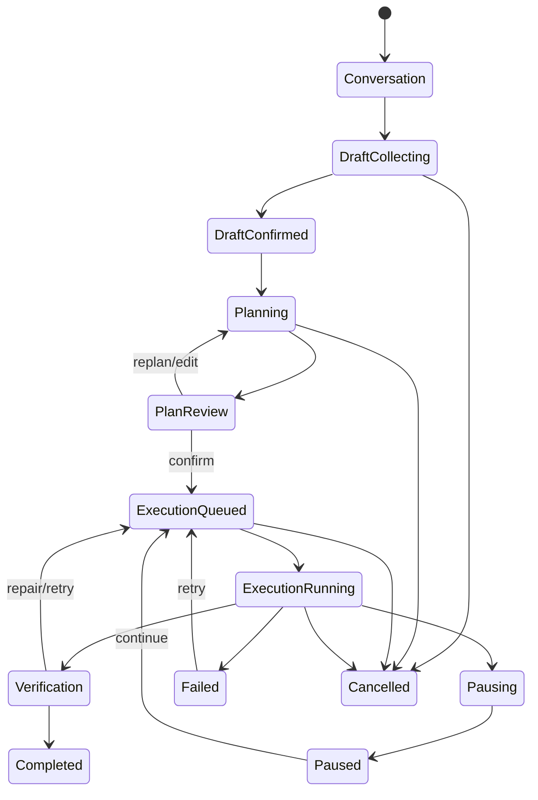
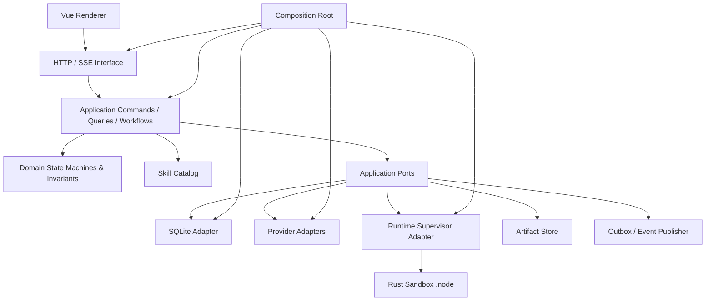

# CodeTask 业务内核重构与开源治理方案

- 状态：Draft（业务重构方案；沙箱与授权路径决策已冻结）
- 日期：2026-07-26
- 适用仓库：`codetask`
- 目标：在不改变现有业务流程和 Business E2E 用户路径的前提下，重新建立唯一、稳定、可组合、可扩展的业务内核
- 已冻结技术决策：复用现有脱胎于 Codex 的 Rust 原生沙箱并继续打包为 Node-API `.node`；取消 Provider 鉴权文件复制，改为宿主精确白名单与实例私有运行目录

---

## 0. 执行摘要

本次不继续修补 Legacy、V3 或再建立一个 V4，而是重新建立一套不带版本号的唯一业务内核：

1. 保留现有用户体验、HTTP API、SSE 语义和 Business E2E 流程。
2. 将业务规则从 Route、SQLite、Provider SDK、Prompt、全局单例中抽离。
3. 业务状态只由一个确定性状态机和一个应用服务入口修改。
4. Planner、草案生成、计划树修改、Task Worker、Verifier 可抽成版本化 Skill。
5. Skill 只产生提案或结构化结果；授权、状态迁移、DAG 校验、落库、重试和最终完成判定必须由确定性 Work 执行。
6. Provider 统一为插件式 Adapter，Codex、Claude Code、OpenCode、Cursor ACP 都走同一生命周期。
7. SQLite 只保存恢复和产品展示真正需要的数据；大日志、二进制和临时运行数据不进入主数据库。
8. 测试从“调用过、没抛错”改成“业务不变量、状态、持久化副作用和外部可观察行为均被验证”。
9. 新内核完成后执行一次离线迁移和原子切换，不做长期双写、双读或 Legacy/V3 运行时回退。
10. 切换完成后删除旧控制面、旧兼容测试、无用依赖、断链文档和版本命名。
11. 沙箱不重新选型：保留现有脱胎于 Codex 的 Rust 实现，通过 Node-API `.node` 与主程序同包发布，不引入 Docker，也不让主程序调用一个可被替换的独立沙箱程序。
12. 删除 `materialize/copy credential` 路径；Provider 使用环境变量、系统凭据库或宿主精确路径白名单读取现有身份，运行状态和临时数据优先写入每个 SDK 实例的私有目录。
13. 同一 Provider 可并行启动多个实例，但不得依赖多个实例共同写一个无并发合同的目录；共享身份状态、任务状态、缓存、日志和 IPC 必须分类授权。
14. 将应用配置、宿主环境、Provider 身份、Turn 控制和子进程环境拆成不同类型与权威来源；禁止把 `process.env` 当作内部配置总线，也禁止用模块级 TS 变量、全局 Getter 或可变单例换一种形式重建隐式全局状态。

“完美”在本方案中的定义不是文件数量少或抽象很多，而是：

- 一个业务事实只有一个权威来源；
- 一个状态只能通过一个合法入口修改；
- 一个 Provider 只实现一个稳定接口；
- 一个测试失败能指出一个明确业务问题；
- 一次任务不会无限消耗内存、磁盘或日志空间；
- 一个 SDK 实例不能读取、修改或终止另一个实例及宿主的非授权资源；
- Provider 身份不再复制到任务目录，白名单也不会退化为整个用户目录读写；
- 一个配置值只有一个声明来源和明确覆盖顺序，运行时不受进程环境或可变模块全局状态的隐式影响；
- 新贡献者能从目录和类型直接找到功能位置；
- 删除旧实现后，系统仍通过同一组黑盒验收。

---

## 1. 范围与非目标

### 1.1 本方案包含

- Conversation、Draft、Planning、Plan Review、Execution、Verification、Recovery 的业务重构。
- Legacy/V3 控制面收敛为唯一业务内核。
- Provider SDK/ACP 统一适配。
- Skill/Work 分层与版本化。
- SQLite 数据模型、事务、Outbox、保留策略和离线迁移。
- HTTP、SSE 和 Renderer 的兼容边界。
- Runtime Supervisor 的普通进程生命周期、取消、超时、输出限额和清理职责。
- 现有 Rust/Node-API 原生沙箱与新 Runtime Adapter 的收敛。
- Provider 文件系统能力清单、宿主鉴权白名单和多实例私有运行目录。
- 进程树所有权、固定端口绑定限制、localhost MCP 精确放行和跨实例隔离合同。
- AppConfig、宿主平台事实、Provider 身份输入、Turn 上下文和子进程环境的分层治理。
- 单元、领域、应用、Adapter Contract、Workflow、Business E2E 测试体系。
- 依赖、文档、错误码、日志和开源可维护性治理。

### 1.2 本方案明确排除

以下内容不在本轮设计和实现范围内：

- 重新选择、自研或整体替换 OS 沙箱技术。
- 引入 Docker 或 `@anthropic-ai/sandbox-runtime` 替换现有原生沙箱。
- 将沙箱拆成由主程序调用、路径可被替换的独立辅助程序。
- 重写现有 Codex 派生的 native crate 核心；本轮只收敛接口、策略输入、打包、测试和已确认的缺陷。
- 用“兼容所有未知 Provider”为理由开放整个用户目录、整个进程表或整个 localhost。
- 将 Credential Broker 作为本轮必需前置条件；它可以后续增强，但不能阻塞已冻结的白名单方案。

以下决策不再属于待讨论范围：

- 沙箱实现采用仓库现有 `native/codeteam-*` Rust 代码，通过 Node-API `.node` 嵌入主程序。
- Provider 鉴权不复制到任务目录，不再保留 `runtime-copy` 作为正常或降级模式。
- 宿主身份访问使用 Provider/平台级精确白名单；未声明路径默认拒绝。
- Provider 任务状态、日志、缓存、临时文件和 IPC 优先使用实例私有目录。
- 必须支持 macOS、Linux、Windows 三平台 conformance；某个平台未达到安全基线时应 fail closed，不静默退化为无沙箱。

这些能力在新业务内核中只保留为外部 Port，不允许其实现细节进入领域和应用层：

```ts
interface ExecutionRuntimePort {
  openTurn(request: RuntimeTurnRequest): Promise<RuntimeTurn>
}

interface ProviderAccessPort {
  checkAvailability(provider: ProviderCode): Promise<ProviderAvailability>
}
```

业务层只知道“Provider 是否可用”和“Turn 是否成功执行”，不知道宿主路径、Node-API、Seatbelt、Job Object 或鉴权白名单细节。Provider Adapter 与 Runtime Adapter 在 Composition Root 中组合出 `ProviderRuntimeProfile`；领域和应用层不得直接拼接路径或放宽权限。

### 1.3 暂不改变的外部行为

- Desktop 与 Server 两种启动模式继续存在。
- Vue 页面主要用户路径不重做。
- 现有 `/api` 业务入口继续可用。
- 现有 SSE 消费方式和核心事件语义继续可用。
- Conversation → Draft → Plan → Confirm → Job → Verify 的流程不变。
- Codex、Claude Code、OpenCode、Cursor CLI 的用户选择能力不变。
- 暂不改变 E2E 测试中的业务步骤和用户可见断言。

---

## 2. 当前仓库的主要问题

### 2.1 Legacy 与 V3 同时表达相同业务

当前存在：

- `src/server/legacy-control-plane/**`
- `src/server/domain/**`
- `src/server/application/**`
- `src/server/infra/sqlite/control-plane/**`
- `src/server/http/v3/**`
- `v3_authoritative`、`preparing`、`copied` 等切换状态

它们同时表达 Job、Task、Run、Pause、Recovery、SSE 和 Repository 语义。

直接后果：

- 修改一个业务动作时，需要判断改 Legacy、V3 还是两边都改。
- V3 Query 仍需要映射成 Legacy DTO，说明外部合同和新领域模型没有真正收敛。
- 测试大量验证“哪一代代码被调用”，而不是验证产品业务是否正确。
- `v3_authoritative` 变成长期存在的产品概念，而不是一次性迁移手段。
- 动态 import 和全局 Context 被用于绕过依赖方向。

### 2.2 Provider 有“驱动层”和“Agent Runtime Provider 层”

当前主要路径包括：

- `src/server/providers/**`
- `src/server/agent-runtime/providers/**`
- `src/sandbox/role-worker-*.ts`
- Provider-specific preflight、turn plan、runtime manager、worker

虽然已经有 `ProviderDriver`、Descriptor 和 Registry，但业务执行仍能看到：

- Provider 代码；
- Provider 运行细节；
- 沙箱贡献；
- 授权准备；
- 会话复用；
- 特定 SDK/ACP 分支。

这使新增 Provider 仍需要修改多个中心文件。

### 2.3 业务、Prompt、MCP 写入和持久化边界不清

当前 Planner、Wizard、Conversation、Legacy MCP handler、Plan Service 都可能参与：

- 生成草案；
- 修改计划树；
- 注册任务；
- 更新进度；
- 生成 Prompt；
- 写 SQLite；
- 发 SSE。

模型输出和业务提交没有形成统一的“提案 → 校验 → 提交”边界。

### 2.4 SQLite 承载了过多历史兼容状态

当前数据库迁移已包含多代 Job 字段、Control Plane 新表、快照、压缩 Plan revision、运行字节数、恢复字段等。

风险包括：

- 同一状态同时存在于多个字段或表中；
- 状态修改缺少唯一事务入口；
- 历史兼容列长期不能删除；
- BLOB、JSON、完整 Payload 容易继续增长；
- 删除任务后，文件、Artifact、Snapshot、Message Payload 的所有权不够直观。

### 2.5 测试数量多，但部分测试业务信号弱

目前测试覆盖面很大，但仍存在以下风险：

- 过多测试直接绑定文件名和内部实现。
- Fake 返回预设结果，实际状态机错误也可能通过。
- 只断言 HTTP 200、函数未抛错或事件出现。
- Legacy/V3 隔离测试多于真实产品合同测试。
- 测试没有系统验证并发命令、幂等、崩溃点和数据一致性。
- Business E2E 文档引用了仓库中已经不存在的文件。

### 2.6 依赖与文档缺少持续治理

当前 `package.json` 中没有原始 `openai` 包，实际 Codex 运行使用的是 `@openai/codex-sdk`，且代码中存在真实动态 import。

这说明依赖治理不能依赖印象或单一静态工具：

- 动态 import 可能被普通 unused-dependency 工具误判；
- 已删除代码遗留的依赖也可能长期存在；
- 文档链接和真实目录可能漂移；
- README 仍可能描述已不再权威的内部实现。

### 2.7 环境变量被当作隐式配置总线，简单替换为 TS 变量仍未解决问题

当前实现曾在多个模块中直接读取或修改 `process.env`，让本应通过调用参数、配置对象或 Port 传递的信息变成进程级隐式状态。常见问题包括：

- CodeTask 自身的运行策略、目录、鉴权模式、沙箱标记或 Turn 控制通过自定义环境变量跨模块传递。
- 同一个值可以来自默认值、数据库 Settings、启动参数、宿主环境或运行时临时写入，但没有唯一覆盖顺序。
- 模块加载时读取环境变量，导致测试修改环境后仍拿到旧值；或测试修改 `process.env` 后污染同进程的后续用例。
- 启动子进程时整体展开 `process.env`，把无关宿主变量、代理配置、调试开关甚至凭据一并传入 SDK。
- Desktop、Server、测试和 Worker 各自解释环境变量，形成多个事实来源。

把这些读取简单改成导出的 `const`、模块级 `let`、`getConfig()` 或全局可变对象并不构成重构。它只是把“环境变量全局状态”换成“TypeScript 全局状态”，仍会造成：

- 依赖在函数签名和构造参数中不可见。
- import 顺序、模块缓存和测试执行顺序影响行为。
- 同一进程无法安全创建两套不同配置的 Application。
- 配置更新可能让部分对象看到新值、部分对象保留旧值。
- 默认值、产品设置、宿主事实、秘密和单次 Turn 输入继续混在一起。

本方案必须区分以下概念，不能再统一称为“环境变量”或“配置”：

| 类别 | 示例 | 权威来源 | 是否允许进入子进程环境 |
| --- | --- | --- | --- |
| 产品配置 | 并发数、超时、默认 Provider、保留期限 | 默认值 + 持久化 Settings + 显式启动覆盖，经统一 Resolver 校验 | 默认不允许 |
| 宿主平台事实 | 平台、架构、可执行文件发现路径、用户目录派生根 | 外层 `HostEnvironmentPort` 的只读快照 | 只作为编译输入，不原样透传 |
| Provider 身份输入 | API Key、Token、系统凭据库、精确身份路径 | Provider/平台声明的 Credential Source | 仅在 Provider Profile 明确声明且无更安全 SDK 入口时允许 |
| 单次 Turn 控制 | Workspace、Role、Limits、Auth Mode、实例目录、幂等键 | 类型化的 Command/`RuntimeTurnRequest` | 不作为 CodeTask 自定义控制变量 |
| 子进程协议环境 | `HOME`、XDG、`TMPDIR`、必要 `PATH`、第三方 SDK 约定变量 | `ChildProcessEnvironmentCompiler` 按 Profile 和实例上下文生成 | 允许，但必须逐项白名单 |

直接后果：

- 配置无法独立验证、追踪来源或确定何时生效。
- 环境变量和全局变量都可能绕过安全策略、数据库 Settings 和审计。
- 多实例、并发测试和嵌入式启动会发生串配置。
- 子进程获得超出 Provider 合同所需的宿主信息，扩大秘密泄露和行为漂移范围。

---

## 3. 不可违反的业务不变量

新内核开始编码前，必须先将以下内容冻结成可执行合同。

### 3.1 产品流程不变量



必须保持：

- Draft 确认前可以编辑，确认后不可静默修改。
- Plan 确认前可以审阅和修改，确认后生成不可变执行代次。
- Task 只能在依赖完成后进入 Ready。
- 同一 Workspace 同一时间只有一个排他的写者。
- Pause、Continue、Cancel、Retry 必须幂等。
- Task 成功不等于 Job 成功；必须经过所需 Verification。
- Provider 结果不确定时不得伪造 Completed。
- 崩溃恢复不得重复提交已经确认的 Task 结果。
- 用户只能读写自己拥有的 Project、Thread、Job 和 Artifact。

### 3.2 外部合同不变量

- 保持现有用户可见错误码的语义。
- SSE 重连后能获得不早于数据库状态的快照。
- 相同 `idempotencyKey` 和相同 Payload 返回同一结果。
- 相同 `idempotencyKey` 和不同 Payload 返回冲突。
- API Route 不直接写多张业务表。
- Renderer 不自行推导服务端权威状态。

### 3.3 数据不变量

- Job 的权威状态只有一列和一个状态机。
- Task Attempt 只属于一个 Job execution generation。
- 一个 Attempt 只能终结一次。
- Outbox 与业务状态在同一事务中提交。
- Artifact 元数据和磁盘文件有明确所有者及过期时间。
- 清理任务可重复执行，不因中途崩溃破坏数据。

### 3.4 配置与环境不变量

- Domain 和 Application 不读取、写入或缓存 `process.env`。
- 任何生产代码都不得修改或删除 `process.env`；测试需要环境替身时使用注入的 `HostEnvironmentPort`。
- 相同 Defaults、Settings、显式启动输入和 Host Snapshot 必须得到相同的不可变 `ResolvedAppConfig`。
- Application 创建后，宿主进程环境的变化不得静默改变进行中的 Job 或 Turn。
- 不存在模块级可变配置、全局配置 Getter 或由 import 副作用创建的默认运行实例。
- 安全硬约束不能被 Settings、CLI、环境变量或单次 Turn 输入放宽。
- 秘密不进入 `ResolvedAppConfig`、SQLite、日志、事件、DTO 或错误对象。
- 子进程环境按 Provider Profile 从空白/最小基线逐项生成，不整体继承宿主环境。
- Provider 因第三方协议必须使用的认证环境变量必须显式声明；未声明变量默认不传递。
- 同一进程创建两套不同配置的 Application 时，二者不得串配置、实例目录、凭据或生命周期。

---

## 4. 目标架构

### 4.1 总体方向

采用“确定性业务内核 + Ports/Adapters + Composition Root + 版本化 Skills”。



依赖方向只能由外向内：

```text
interfaces/adapters -> application -> domain
composition         -> 所有层
domain              -> 不依赖任何外层
```

### 4.2 推荐目录

先保持单仓库和单 TypeScript 构建，避免重构同时引入 monorepo、workspace 发布和构建系统风险。

```text
src/server/
  core/
    domain/
      conversation/
      drafts/
      plans/
      jobs/
      tasks/
      verification/
      retention/
    application/
      commands/
      queries/
      workflows/
      ports/
      policies/
    skills/
      contracts/
      catalog/
      builtins/
  adapters/
    sqlite/
    providers/
      codex/
      claude/
      opencode/
      cursor/
    runtime/
    artifacts/
    clock/
    ids/
  interfaces/
    http/
    sse/
    mcp/
  composition/
    create-application.ts
    create-provider-registry.ts
    create-http-server.ts
  compatibility/
    legacy-api-mapper.ts
    legacy-sse-mapper.ts
```

规则：

- 不创建 `v4`、`next`、`new-control-plane`。
- `compatibility` 是一次性目录，切换完成后必须删除。
- 新业务代码不得 import `legacy-control-plane` 或旧 V3 Application。
- 旧代码可临时调用新内核，不能反向让新内核调用旧代码。

### 4.3 Composition Root 规范

只有 `src/server/composition/**` 可以：

- `new` Repository、Service、Provider Driver。
- 调用统一 Config Resolver 生成 `ResolvedAppConfig`。
- 通过唯一 `HostEnvironmentPort` 获取宿主环境快照；原始 `process.env` 只允许在进程入口或最外层 Environment Adapter 中读取。
- 选择 Desktop/Server Adapter。
- 注册生命周期和 Shutdown Hook。
- 创建全局长生命周期实例。

其他目录禁止：

- `getAppContext()`。
- `getDb()` 全局访问。
- 模块加载时创建默认 Registry。
- 在业务函数内部动态获取单例。
- 从 `process.env` 推导业务策略。
- 修改、删除或临时覆盖 `process.env`。
- 导入默认配置常量并绕过 Config Resolver。
- 使用模块级 `let`、可变导出对象或全局 Getter 保存当前配置。
- 将完整 `process.env` 展开到 Provider 或其他子进程。

应用对象通过构造参数显式注入：

```ts
interface ApplicationDependencies {
  readonly unitOfWork: UnitOfWork
  readonly providers: ProviderRegistryPort
  readonly runtime: ExecutionRuntimePort
  readonly skills: SkillCatalog
  readonly artifacts: ArtifactStore
  readonly clock: Clock
  readonly ids: IdGenerator
  readonly events: EventPublisher
  readonly logger: SafeLogger
}
```

### 4.4 配置来源与环境边界

#### 4.4.1 唯一解析路径

配置只允许沿以下单向路径进入系统：

```text
Build-time constants ─┐
Persisted Settings ───┼─> Config Resolver ─> ResolvedAppConfig ─> Composition Root
Bootstrap overrides ──┘

Host process env ─> HostEnvironmentAdapter ─> Host/Platform Facts
                                           └─> Provider Credential Sources

ResolvedAppConfig + Host Facts + Provider Profile + Turn Context
    └─> ChildProcessEnvironmentCompiler ─> 最小子进程环境
```

覆盖顺序固定为：

1. 不可放宽的安全硬约束。
2. 显式 Bootstrap/CLI 覆盖。
3. 持久化 Settings。
4. 产品默认值。

宿主环境是平台事实和外部集成输入，不是产品配置的通用覆盖层。单次 Turn 输入只能在已解析策略范围内收窄能力，不能扩大沙箱、文件、网络、进程或秘密访问权限。

#### 4.4.2 类型边界

建议合同：

```ts
interface BootstrapInputs {
  readonly mode: 'desktop' | 'server'
  readonly dataDir?: string
  readonly configOverrides: Readonly<Partial<AppConfigInput>>
  readonly settings: SettingsSnapshot
  readonly host: HostEnvironmentPort
}

interface ResolvedAppConfig {
  readonly execution: Readonly<ExecutionConfig>
  readonly retention: Readonly<RetentionConfig>
  readonly providers: Readonly<ProviderSelectionConfig>
  readonly runtime: Readonly<RuntimePolicyConfig>
}

interface ProviderLaunchContext {
  readonly config: ProviderResolvedConfig
  readonly host: ProviderHostAccess
  readonly turn: RuntimeTurnRequest
  readonly instance: InstanceRuntimePaths
}

interface ChildProcessEnvironmentCompiler {
  compile(
    input: ProviderLaunchContext
  ): Readonly<Record<string, string>>
}
```

要求：

- `ResolvedAppConfig` 在启动时完成合并、Schema 校验和 `deepFreeze`，对象本身不含秘密。
- Settings 更新生成带 revision 的新快照；只在明确的重建/重载边界生效，不原地修改已注入对象。
- `HostEnvironmentPort` 返回所需字段或受控查询结果，不把整个 `NodeJS.ProcessEnv` 传给业务层。
- Provider 凭据使用专门的 Secret/Credential Port；返回值不得被序列化、持久化或写日志。
- 所有 Application、Adapter 和 Work 通过构造参数或方法参数接收依赖，不从模块全局查找“当前配置”。
- 长生命周期实例由 Composition Root 持有并显式 `dispose`，不以 import 副作用注册。

#### 4.4.3 环境变量使用规则

CodeTask 内部控制面不得再新增或依赖自定义环境变量传递 `authMode`、`runtimeRoot`、沙箱状态、幂等键、Workspace、Role、Limits 或 Job/Task 标识。这些信息必须进入类型化请求。

允许的环境变量只限于外部边界：

- 启动入口读取宿主变量并转换为 Bootstrap 输入或 Host Facts。
- Provider 第三方协议要求的认证变量；优先使用 SDK Option 或系统凭据库，必须使用环境变量时由版本化 Profile 逐项声明。
- 为实例隔离而生成的 `HOME`、XDG、临时目录、缓存目录和必要工具链 `PATH`。
- 操作系统或运行时确实要求的最小变量。

禁止：

- 在生产代码中赋值、删除或用 `Object.assign` 修改 `process.env`。
- 以 `...process.env`、`Object.assign({}, process.env)` 等方式整体继承宿主环境。
- 把秘密放入 argv、日志、数据库、事件、错误消息或普通临时文件。
- 把环境变量名拼接成动态后门，绕过静态白名单。

Worker/Native 进程输入应使用结构化 Spawn Request、受控 IPC/stdin，或由 Runtime 拥有且权限为 `0600` 的短期文件；不能借 CodeTask 自定义环境变量承担内部消息总线职责。

#### 4.4.4 TypeScript 常量与全局状态规则

允许存在冻结的纯默认值和编译期常量，但它们只能被 Config Resolver 使用。业务代码不得直接 import Defaults 形成第二条配置路径。

禁止以以下方式替代环境变量：

- `export let currentConfig`。
- `globalThis.appConfig`。
- 无参数 `getConfig()` / `getRuntimeRoot()`。
- import 时捕获 `process.env` 的常量。
- 模块顶层创建 Registry、Database、Provider 或 Runtime。

验收标准不是“代码里没有 `process.env` 字样”，而是配置依赖显式、来源唯一、对象不可变、实例可隔离、秘密有边界、更新有确定生效时机。

---

## 5. Domain：唯一业务事实

### 5.1 Domain 中允许存在

- 不可变 Entity、Value Object、Aggregate。
- 判定和状态迁移函数。
- DAG 和 Plan 结构校验。
- Job、Task、Verification 的合法动作。
- 结构化 Domain Error。

### 5.2 Domain 中禁止存在

- SQLite、Drizzle、Hono、Electron。
- Provider SDK/ACP 类型。
- 文件路径和进程启动。
- Prompt 文本。
- Date.now、randomUUID。
- 环境变量。
- SSE、HTTP 状态码。
- 日志输出。

### 5.3 核心 Aggregate

#### Thread

负责：

- Conversation 上下文归属。
- 当前 Draft/Plan/Job 指针。
- 用户和 Project 所有权。

不负责：

- 运行 Provider Turn。
- 保存完整 Provider session。
- 推导 Job 状态。

#### Draft

状态：

```text
collecting -> confirmed
collecting -> abandoned
```

Draft Confirm 后内容不可原地修改。修改需求必须创建新 revision。

#### Plan

包含：

- Plan revision。
- Milestone / Slice / Task 节点。
- Dependency edges。
- Ability 和 Provider 建议。
- Success criteria。

Plan 修改必须使用显式 Operation：

```ts
type PlanOperation =
  | { type: 'add_node'; parentId: string; node: PlanNodeInput }
  | { type: 'update_node'; nodeId: string; patch: PlanNodePatch }
  | { type: 'move_node'; nodeId: string; parentId: string; index: number }
  | { type: 'remove_node'; nodeId: string }
  | { type: 'add_dependency'; fromTaskId: string; toTaskId: string }
  | { type: 'remove_dependency'; fromTaskId: string; toTaskId: string }
```

禁止模型直接提交完整替换后的数据库树。

#### Job

Job 只保存：

- 当前 State。
- 当前 Plan revision。
- execution generation。
- active run。
- control intent。
- last failure。
- state revision。

所有状态迁移必须经过一个 `JobCommandService`。

#### Task Attempt

每次执行单独建 Attempt：

- `attemptId`
- `taskId`
- `executionGeneration`
- `idempotencyKey`
- `status`
- `startedAt`
- `finishedAt`
- `resultHash`
- `errorCode`
- `resourceSummary`

不得在原 Task 行上不断覆盖执行历史。

#### Verification Attempt

Verification 是一等业务对象，不再只是 Prompt 后的布尔值。

结构化结果：

```ts
interface VerificationResult {
  readonly verdict: 'pass' | 'fail' | 'inconclusive'
  readonly summary: string
  readonly evidenceRefs: readonly string[]
  readonly findings: readonly VerificationFinding[]
}
```

`inconclusive` 不得映射为 `pass`。

---

## 6. Application：确定性 Work

### 6.1 Command 与 Query 分离

Command：

- 修改状态。
- 必须带 Actor、Idempotency Key 和 Expected Revision。
- 在一个 Unit of Work 中提交业务状态和 Outbox。
- 返回最小结果。

Query：

- 只读取投影。
- 不触发恢复、修复或 Provider 调用。
- 不更新 last-seen 等隐式业务字段，除非它本身是显式 Command。

### 6.2 固定 Work 流程

建议只保留以下权威 Work：

```text
ConversationTurnWork
FreezeDraftWork
GeneratePlanWork
ApplyPlanOperationsWork
ConfirmPlanWork
ScheduleJobWork
ExecuteTaskWork
VerifySliceWork
VerifyMilestoneWork
RecoverInterruptedRunWork
PurgeTerminalTaskDataWork
```

每个 Work 的统一结构：

```ts
interface Work<I, O> {
  execute(input: I, context: WorkContext): Promise<O>
}

interface WorkContext {
  readonly actor: Actor
  readonly requestId: string
  readonly idempotencyKey: string
  readonly signal: AbortSignal
}
```

### 6.3 Work 不得做的事情

- Route 内直接拼 Prompt。
- Skill 内直接写数据库。
- Provider Chunk 到来时直接改 Job 状态。
- Query 时顺便恢复状态。
- Catch 所有错误后返回成功。
- 用字符串包含关系推导错误类别。
- 同一个函数同时负责调度、执行、持久化、SSE 和清理。

---

## 7. Skill 与 Work 的边界

### 7.1 Skill 负责什么

Skill 是版本化的模型行为包，负责：

- Prompt 模板。
- 输入/输出 Schema。
- 角色描述。
- 可用工具声明。
- 示例和领域参考。
- 模型输出的语义约定。

推荐目录：

```text
src/server/core/skills/builtins/
  draft-clarifier/
    manifest.ts
    prompt.md
    input.schema.ts
    output.schema.ts
  planner/
  plan-editor/
  task-worker/
  slice-verifier/
  milestone-verifier/
  repair-advisor/
```

Manifest：

```ts
interface SkillManifest<I, O> {
  readonly id: string
  readonly version: string
  readonly role: AgentRole
  readonly inputSchema: Schema<I>
  readonly outputSchema: Schema<O>
  readonly promptTemplate: string
  readonly allowedTools: readonly string[]
  readonly defaultTimeoutMs: number
}
```

### 7.2 Skill 不负责什么

Skill 不得：

- 判断用户是否有权限。
- 修改 Job/Task 状态。
- 生成数据库主键。
- 绕过 Plan DAG 校验。
- 决定幂等结果。
- 直接发送 SSE。
- 直接删除 Artifact。
- 决定最终 Job completed。

### 7.3 提案到提交

统一处理模型输出：

```text
Skill 输出
  -> Schema Parse
  -> 语义校验
  -> 权限校验
  -> Revision / Idempotency 校验
  -> Domain Transition
  -> Transaction Commit
  -> Outbox
  -> SSE Projection
```

映射关系：

| 业务步骤       | Skill                | 确定性 Work                                         |
| -------------- | -------------------- | --------------------------------------------------- |
| 收集需求       | `draft-clarifier`    | 合并允许修改的 Draft 字段                           |
| 生成计划       | `planner`            | 校验 DAG、节点 ID、Ability、Success Criteria 后提交 |
| 编辑计划树     | `plan-editor`        | 应用有限的 `PlanOperation`                          |
| 执行任务       | `task-worker`        | 建 Attempt、调 Provider、验证结果、提交 Checkpoint  |
| Slice 校验     | `slice-verifier`     | 验证输出 Schema 和 Evidence，决定后续动作           |
| Milestone 校验 | `milestone-verifier` | 运行完成门禁，不允许 Skill 直接完成 Job             |
| 失败修复建议   | `repair-advisor`     | 用户或策略选择后创建新 Attempt                      |

---

## 8. Provider 插件规范

### 8.1 唯一接口

业务层只依赖：

```ts
interface ProviderAdapter {
  readonly descriptor: ProviderDescriptor

  discover(): Promise<ProviderAvailability>
  preflight(request: ProviderPreflightRequest): Promise<ProviderPreflightResult>
  openTurn(request: ProviderTurnRequest): Promise<ProviderTurn>
  shutdown(): Promise<void>
}

interface ProviderTurn {
  readonly sessionId?: string
  stream(signal: AbortSignal): AsyncIterable<ProviderEvent>
  cancel(reason: string): Promise<void>
  close(): Promise<void>
}
```

### 8.2 统一 Provider Event

```ts
type ProviderEvent =
  | { type: 'text_delta'; text: string }
  | { type: 'reasoning_delta'; text: string }
  | { type: 'tool_started'; toolCallId: string; toolName: string }
  | { type: 'tool_finished'; toolCallId: string; outcome: 'ok' | 'error' }
  | { type: 'progress'; code: string; message?: string }
  | { type: 'usage'; inputTokens?: number; outputTokens?: number }
  | { type: 'result'; result: ProviderResult }
  | { type: 'error'; error: ProviderError }
```

业务层不得依赖 Codex SDK、Claude SDK、OpenCode SDK 或 ACP 的原始 Event 类型。

### 8.3 新增 Provider 的修改范围

新增 Provider 只允许修改：

- 新 Provider Adapter 目录。
- Descriptor/Catalog 注册。
- Provider Contract Fixture。
- 设置页的 Provider 展示配置。

不应修改：

- Job 状态机。
- Planner Work。
- Task Work。
- SSE reducer。
- SQLite Repository。
- 其他 Provider Adapter。

### 8.4 当前 Provider 代码收敛

目标状态：

- `src/server/providers/**` 与 `src/server/agent-runtime/providers/**` 合并成一个 Adapter 层。
- `role-worker-*` 中的协议差异下沉到对应 Adapter。
- Runtime Manager 只管理生命周期，不再包含 Provider 业务分支。
- Provider Capability 由 Descriptor 数据声明，不散落 `if provider === ...`。
- Codex 保留 `@openai/codex-sdk`；原始 `openai` 包当前不存在，不应重新引入。

### 8.5 Provider Runtime Profile

每个 Provider Adapter 必须随 Descriptor 声明版本化运行需求，禁止继续在授权 Bridge、Worker 和 Sandbox Manager 中分别维护路径分支：

```ts
interface ProviderRuntimeProfile {
  readonly provider: ProviderCode
  readonly version: number
  readonly environment: Readonly<Record<string, string>>
  readonly filesystem: {
    readonly hostRead: readonly PathCapability[]
    readonly hostWrite: readonly PathCapability[]
    readonly instanceReadWrite: readonly InstancePathKind[]
  }
  readonly credentials: readonly CredentialAccessMethod[]
  readonly network: ProviderNetworkProfile
  readonly process: ProviderProcessProfile
}

type CredentialAccessMethod =
  | { type: 'environment'; names: readonly string[] }
  | { type: 'os-keyring'; service: string }
  | { type: 'host-path'; paths: readonly PathCapability[] }

interface PathCapability {
  readonly path: string
  readonly access: 'read' | 'read-write'
  readonly purpose: 'credential' | 'config' | 'toolchain' | 'mcp' | 'provider-state'
  readonly required: boolean
}
```

要求：

- Profile 由 Adapter 提供，由 Runtime Policy Compiler 校验和编译，Provider 进程不能自行追加权限。
- `path` 必须是平台 Resolver 解析后的绝对规范路径，不接受 Provider 返回的任意字符串。
- 白名单按文件或最小目录声明；禁止使用 `$HOME`、`USERPROFILE`、系统根目录或通配整个用户目录。
- Optional 路径不存在时忽略；Required 路径不存在时 Preflight 明确失败。
- Descriptor/Profile 修改必须更新安全审计、Contract Fixture 和三平台 conformance。
- 鉴权文件不复制、不生成快照、不在 SQLite 中保存内容；SQLite 最多保存 Provider、方法、路径类型、凭据指纹和到期信息。

### 8.6 已冻结的 Provider 身份策略

统一优先级：

```text
SDK option / environment / workload identity
  -> OS credential store
  -> 宿主精确文件或 Provider 私有目录白名单
  -> 不支持则 Preflight 失败
```

不再以“复制鉴权文件到 runtime home”作为回退。

| Provider | 首选无文件方式 | 宿主白名单用途 | 实例私有写入 |
| -------- | -------------- | -------------- | ------------ |
| Codex | SDK `apiKey` / `CODEX_API_KEY` / Keychain | 订阅身份和明确启用的 Codex 配置；只开放实际解析路径 | session、state、log、tmp；使用独立 `CODEX_HOME` 时全部落在实例目录 |
| Claude Code | `ANTHROPIC_API_KEY`、Token、WIF | 系统凭据库和明确启用的 Claude 设置/MCP 路径 | `.claude` 运行状态、session、log、tmp |
| Cursor CLI/ACP | `CURSOR_API_KEY` | Cursor 身份目录、系统凭据库和显式配置 | `.cursor` 运行状态、ACP IPC、log、tmp |
| OpenCode | Provider API Key、云身份链 | OpenCode auth/config/data 的已知平台路径 | XDG config/data/cache、server state、log、tmp |
| 其他 ACP | `initialize.authMethods` 声明的方法 | 只有注册 Adapter 明确解析的路径 | Agent home、state、IPC、log、tmp |

“宿主白名单”意味着 SDK 仍能看到且在 `read-write` 时能修改白名单内的数据。因此：

- 凭据文件默认只读。
- 经三平台测试确认 OAuth 刷新必须回写时，只允许对应凭据文件或最小身份目录读写，并加 Provider/账户级 Credential Lease。
- 不因一个 Provider 需要 `~/.cursor` 就开放整个 HOME。
- 不允许清理器递归删除宿主 Provider 目录；它只能删除本次运行 manifest 明确记录且位于实例目录内的文件。
- Provider 将身份、session、日志混在同一固定目录且无法拆分时，必须为共享 Provider 目录建立专项并发和崩溃测试；未通过前不能宣称支持多实例。

### 8.7 多实例合同

“官方 CLI 可以打开多个窗口”只作为兼容线索，不作为并发安全证明。CodeTask 的强制合同是：

- 每个 `RuntimeTurn` 具有唯一 `instanceId`。
- 每个实例拥有独立 `home/config/data/cache/state/tmp/log/ipc`。
- 两个实例不得共享 PID 文件、Unix socket、named pipe、日志文件或本地 server 端口。
- 同一 Provider/账户的宿主身份刷新通过短期 Credential Lease 串行化；模型 Turn 本身仍可并行。
- 同一业务 Workspace 默认只有一个写租约；并行 Executor 使用不同 Git worktree。
- 同一 Provider session 的恢复由一个实例持有写租约，禁止两个进程同时 resume 并写同一 session。
- OpenCode 采用“一任务一 server、多 session”或“一实例一 server”之一，不能启动多个 server 共同写一个数据目录。
- 清理、取消或 OOM 终止只能作用于当前实例登记的进程树和实例目录。

---

## 9. SQLite 与数据生命周期

### 9.1 数据库职责

SQLite 保存：

- 用户、Project、Thread 的产品状态。
- Draft/Plan 的当前权威 revision。
- Job、Run、Task Attempt、Verification Attempt。
- 幂等记录。
- Outbox。
- Artifact 元数据。
- 清理 Lease 和最小恢复 Checkpoint。
- 有界的消息内容和业务摘要。

SQLite 不保存：

- 无限 Provider stdout/stderr。
- 每个流式 Token。
- 工作区压缩包。
- 大型二进制 Artifact。
- 完整临时运行目录。
- 无上限历史快照。
- Provider 凭据。

### 9.2 推荐表

```text
projects
threads
messages
drafts
draft_revisions
plans
plan_nodes
plan_edges
jobs
job_runs
task_attempts
verification_attempts
command_dedup
outbox
artifacts
cleanup_leases
```

### 9.3 当前状态与投影分离

- `jobs` 保存当前权威状态。
- `job_runs` 保存每次运行。
- `task_attempts` 保存每次 Task 执行。
- UI 所需 `ThreadJobDto` 是 Query Projection，不是数据库表结构。
- SSE Snapshot 使用同一 Query Projection。
- 不允许为了兼容旧 DTO，把几十个重复进度字段继续写回 `jobs`。

### 9.4 事务边界

每个 Command 的事务：

```text
读取 Aggregate
  -> 校验 Actor / Revision / Idempotency
  -> Domain Transition
  -> 更新 Aggregate
  -> 写 Attempt/Run（如需要）
  -> 写 Outbox
  -> 写 Command Receipt
  -> Commit
```

事务提交后：

- Outbox Dispatcher 发布 SSE。
- Runtime Controller 执行异步启动/停止。
- 异步失败通过新 Command 回写，不回滚已经提交的用户意图。

### 9.5 任务完成后的清理

终态后立即删除：

- 原始 Provider 流。
- 临时 stdout/stderr。
- 临时 Session 数据。
- Task runtime 目录。
- 未被产品引用的中间 Artifact。

长期最小保留：

- Task/Job ID。
- 状态和时间。
- 最终摘要。
- Result/Evidence hash。
- Provider/Skill version。
- 错误码。
- 资源统计。

保留时间应配置化：

```ts
interface RetentionPolicy {
  readonly rawOutputTtlMs: number
  readonly transientArtifactTtlMs: number
  readonly completedTaskDetailTtlMs: number
  readonly failedTaskDetailTtlMs: number
}
```

### 9.6 大小限制

建议第一版硬限制：

- 单条 Message 正文：1 MiB。
- 单条结构化 Provider Result：2 MiB。
- 单 Task 保留 stdout tail：128 KiB。
- 单 Task 保留 stderr tail：128 KiB。
- 单 Job 有界事件窗口：5 MiB 或 2,000 条，取先到者。
- 主数据库禁止写入大于 2 MiB 的单个业务 BLOB。
- Artifact 必须使用文件存储，并保存 SHA-256 和大小。

具体数值可配置，但必须存在默认上限。

---

## 10. Runtime 稳定性与原生沙箱

### 10.1 已冻结的沙箱实现

本轮继续使用仓库已有、脱胎于 Codex 的 Rust 沙箱能力：

```text
TypeScript Runtime Adapter
  -> Node-API binding
  -> packaged .node
  -> codeteam sandbox policy / platform backend
  -> sandboxed SDK/ACP process tree
```

决策：

- Rust native crates 与 Node 主程序一起构建、签名和打包。
- 主程序只加载随包发布且经过完整性校验的 `.node`，不从 PATH 查找沙箱实现。
- 对用户表现为一个主程序；不要求 Docker，也不要求用户安装另一个 sandbox runtime。
- Node/TypeScript 负责组合 Provider Profile、业务 Workspace 和任务资源上限。
- Rust 负责不可绕过的进程创建、OS policy 应用、句柄/进程树所有权和平台能力。
- 不使用纯 Node 文件 API、monkey patch、命令黑名单或 Prompt 约束充当安全边界。
- 若某平台 native binding 缺失、校验失败或关键能力不可用，受保护任务必须 fail closed。

native 来源、第三方 License、与上游 Codex 的差异必须写入 `NOTICE` 和专门的 Native Sandbox 文档；开源前不得以“自己写的”掩盖派生关系。

### 10.2 原生边界与防替换

`.node` 方案并不意味着 Node 代码本身可信。边界必须满足：

- `.node` 只暴露结构化 `spawn/terminate/queryCapabilities`，不暴露任意 native command。
- 策略输入先在 TypeScript 校验，再由 Rust 重新校验；native 层不信任 JS 已完成校验。
- 传入路径必须绝对化、规范化并验证存在性/所有权。
- 解析符号链接、junction、reparse point 后再次检查白名单，拒绝通过链接逃逸。
- 子进程启动前关闭非必需继承句柄和文件描述符。
- 安装 sandbox policy 后再执行 SDK/ACP 入口，不能先启动目标进程再补权限。
- `.node` 的平台产物、ABI、hash、签名和构建来源进入 Release Manifest。
- 禁止设置“沙箱失败后无保护重试”的兼容分支。

平台实现可以不同，但必须达到同一合同：

| 平台 | 允许使用的现有后端 | 必需能力 |
| ---- | ------------------ | -------- |
| macOS | Seatbelt + 原生进程管理 | 文件白名单、进程树所有权、网络/localhost 策略、资源和清理合同 |
| Linux | 现有 Linux sandbox/seccomp 后端 | 文件白名单、PID/进程树隔离、网络策略、资源限制 |
| Windows | 现有 Windows sandbox + Job Object 等能力 | 文件/令牌策略、Job 进程树、句柄隔离、网络策略 |

### 10.3 每实例运行目录

每个 SDK/ACP 实例分配唯一目录：

```text
runtime/
  task-{taskId}/
    workspace/
    instances/
      {provider}-{instanceId}/
        home/
        config/
        data/
        cache/
        state/
        tmp/
        logs/
        ipc/
        manifest.json
```

POSIX 环境至少重定向：

```text
HOME
XDG_CONFIG_HOME
XDG_DATA_HOME
XDG_CACHE_HOME
XDG_STATE_HOME
TMPDIR
```

Windows 环境至少重定向：

```text
USERPROFILE
APPDATA
LOCALAPPDATA
TEMP
TMP
```

环境重定向只决定 SDK 默认路径，不是安全边界；native policy 必须同时拒绝实例目录和显式宿主白名单以外的访问。

目录规则：

- SDK 状态、session、缓存、日志、IPC 默认写实例目录。
- 工具链、只读依赖和明确启用的 Skills 可以精确只读共享。
- 不共享日志、PID、socket、临时文件和本地 server 数据目录。
- 共享写缓存不是第一版需求；后续只能引入内容寻址、完整性校验和原子提交的缓存服务。
- 同一 session 需要恢复时，复用其状态所有权或显式迁移，不能让两个实例同时写。

### 10.4 文件系统白名单

有效权限由受信任的三类输入求并集后再规范化：

```text
BasePlatformProfile
  + ProviderRuntimeProfile
  + TaskWorkspaceCapability
  = EffectiveSandboxPolicy
```

白名单必须满足：

- 默认拒绝。
- 区分 `read` 与 `read-write`。
- 区分宿主路径与实例路径。
- 禁止整个 HOME、用户 Profile、磁盘根目录和系统进程目录。
- 禁止未展开变量、模糊 glob 和 Provider 自报路径直接进入 policy。
- 对 `.git`、`.ssh`、云凭据、浏览器数据、系统 Keychain socket 等敏感路径单独分类。
- Workspace 写权限只授予持有业务写租约的 Executor；Planner 和 Verifier 默认只读。
- Provider Preflight 只能报告缺失能力，不能在运行时静默扩大权限。

鉴权从 copy 改为白名单后的约束：

- 删除 Codex、Cursor、OpenCode 等 `materialize*Auth` 正常路径和 `runtime-copy` 模式。
- 环境变量和 OS credential store 不创建任务鉴权文件。
- 使用文件身份时，SDK 按原生宿主路径访问，policy 只放行该文件或最小 Provider 身份目录。
- 默认只读；只有已验证的 Token refresh 才能得到最小 `read-write` 能力。
- 共享鉴权写入使用 Provider/账户级 Lease，并验证多进程刷新、原子替换和崩溃恢复。
- 不在任务结束时“同步回宿主”；因为从未复制，也不存在 copy-back。
- 清理器禁止删除、截断或重建宿主身份文件。
- 不支持该白名单模型的鉴权方式必须在 Preflight 中明确说明，不能回退为复制或整个 HOME。

### 10.5 进程、线程与多实例隔离

每个 Runtime 实例必须登记：

```text
instanceId
rootProcessIdentity
ownedProcessTree
provider/session ownership
workspace lease
credential lease（如有）
resource budget
runtime paths
allocated ports/sockets
```

规则：

- SDK 只能观察、等待、发送信号或终止自己的进程树。
- `kill node`、`pkill python`、枚举后批量终止等操作不得影响宿主或其他实例。
- 终止以 OS 提供的进程身份/句柄为准，不能只依赖可复用的 PID。
- 后台孙进程必须被纳入同一实例所有权；父进程退出不代表进程树已清理。
- Windows 使用 Job 所有权；Linux/macOS 使用现有平台能力和受监督进程组，能力不足必须出现在 conformance 报告中。
- 不允许 SDK 附加、调试、注入或打开其他实例的进程/线程句柄。
- 应用退出、取消、超时和 OOM 后清理必须幂等，且只能处理当前实例所有资源。

### 10.6 网络、固定端口与 localhost MCP

默认网络策略允许模型 Provider 所需外网，但不等于开放宿主 localhost。

必须区分：

```text
internet egress
approved localhost MCP endpoint
local server listen/bind
host loopback services
```

规则：

- SDK 不得访问未声明的宿主 loopback 端口。
- 本地 MCP 通过 endpoint allowlist 或受管代理开放，只授予已配置的 URL/socket。
- 外部已占用或策略保留的固定端口（例如 `5173`）不得由沙箱实例绑定、接管或通过终止宿主进程释放。
- OpenCode/ACP 本地 server 使用端口分配器、端口 `0` 或预留 socket；每实例唯一。
- 端口检查后再启动存在 TOCTOU，优先由 Supervisor 持有预留 socket/句柄并安全交接。
- 无法在某平台按进程精确隔离 localhost 时，不宣称“完整支持”；应通过受管代理收窄访问或 fail closed。

### 10.7 Supervisor 职责

Runtime Supervisor 负责：

- 所有子进程/SDK session 的所有权登记。
- Provider Profile 与任务能力合并。
- 调用 `.node` 创建受保护进程。
- AbortSignal 传播。
- 软取消、超时、硬终止。
- stdout/stderr 流式读取和背压。
- 输出字节限制。
- 运行目录大小统计。
- 峰值资源摘要。
- 进程退出后的幂等清理。
- 应用关闭时统一 drain。

Supervisor 不得绕过 native 层直接以普通 `spawn` 启动受保护 SDK。

### 10.8 禁止无限缓冲

统一使用 Ring Buffer：

```ts
interface BoundedOutput {
  readonly bytesSeen: number
  readonly bytesRetained: number
  readonly truncated: boolean
  tail(): Buffer
}
```

禁止：

- `exec`/`execSync` 接收未知大小输出。
- `allOutput += chunk`。
- 将完整 stdout 保存为一个 SQLite TEXT/BLOB。
- 为了生成错误信息再次读取完整日志文件。
- SDK 自己生成的无界日志绕过 Runtime 配额。

### 10.9 生命周期

```text
created
  -> policy_compiled
  -> starting
  -> sandboxed
  -> running
  -> stopping
  -> exited
  -> cleaned
```

规则：

- 每个 Runtime Handle 只能关闭一次。
- `close()` 和 `cancel()` 必须幂等。
- 未进入 `sandboxed` 状态不得执行 Provider 入口。
- 清理失败写入结构化 Cleanup Failure。
- 应用重启时只恢复数据库声明为活跃、但没有有效 Lease 的 Run。
- 不以“进程不存在”直接推导 Task 成功。
- `cleaned` 前验证进程树、端口/IPC 和实例临时目录均已释放。

---

## 11. HTTP、SSE 与 Renderer 兼容

### 11.1 Route 只做四件事

1. 身份认证和请求边界。
2. 输入 Schema 解析。
3. 调用 Command/Query。
4. DTO/Error 映射。

Route 不做：

- SQL。
- 状态迁移。
- Provider 调用。
- Prompt 拼接。
- 恢复逻辑。
- SSE 事件生成。

### 11.2 临时兼容层

迁移期间使用：

```text
New Core DTO
  -> legacy-api-mapper
  -> 现有 Renderer/API DTO

New Outbox Event
  -> legacy-sse-mapper
  -> 现有 SSE event/data
```

要求：

- 只能单向从新内核映射到旧外部合同。
- 禁止把旧 DTO cast 成新 Aggregate。
- Mapper 必须有 Contract Test。
- Mapper 不允许访问数据库。
- 切换完成、Renderer 迁移后删除。

### 11.3 SSE

SSE 使用：

- 单调 `eventId`。
- Topic。
- Entity ID。
- Aggregate revision。
- 类型化 Payload。

Reducer 规则：

- 旧 revision 事件忽略。
- 缺口触发 Snapshot Refresh。
- Snapshot revision 不得低于已应用 revision。
- 重连不依赖服务端内存历史才能恢复正确 UI。

---

## 12. 错误、日志与可观测性

### 12.1 错误类型

```ts
interface AppFailure {
  readonly code: string
  readonly category:
    | 'validation'
    | 'conflict'
    | 'not_found'
    | 'provider'
    | 'runtime'
    | 'storage'
    | 'cancelled'
    | 'timeout'
    | 'internal'
  readonly retryable: boolean
  readonly safeMessage: string
  readonly causeCode?: string
  readonly details?: Readonly<Record<string, string | number | boolean>>
}
```

规则：

- 业务判断只看稳定 Error Code，不匹配英文错误字符串。
- 外部 SDK Error 在 Adapter 边界归一化。
- 日志可记录内部 Cause，但 API 只返回 Safe Message。
- `cancelled`、`timeout`、`failed`、`inconclusive` 不得混用。

### 12.2 结构化日志字段

每条运行日志应尽量包含：

```text
requestId
projectId
threadId
jobId
runId
taskId
attemptId
provider
skillId
skillVersion
event
durationMs
```

禁止日志包含：

- 凭据。
- 完整 Prompt。
- 完整 Provider Response。
- 用户目录全路径（报告中应脱敏）。
- 任意大小文件内容。

### 12.3 调试包

每个失败任务最多生成一个有界调试包：

- 状态摘要。
- Error Code。
- 配置哈希。
- stdout/stderr tail。
- 相关 Artifact 清单。
- 时间线。

默认总大小不超过 1 MiB。

---

## 13. 代码风格与组合约束

### 13.1 TypeScript

- `strict` 开启。
- 新核心禁止 `any`。
- 禁止跨层 `as unknown as`。
- DTO、Domain Entity、DB Row 分别定义。
- 使用 discriminated union 表达状态。
- 所有异步 Work 接收 `AbortSignal`。
- 时间和 ID 通过 Port 注入。
- 输入默认只读。
- Provider/Skill code 使用稳定枚举或 branded string。

### 13.2 文件和函数

软限制：

- 单函数目标不超过 60 行。
- 单业务模块目标不超过 400 行。
- 一个文件只暴露一个主要职责。
- 超限必须能说明其凝聚性，不能简单按行数拆出无意义 helper。

### 13.3 命名

允许：

```text
JobCommandService
ExecuteTaskWork
SqliteJobRepository
CodexProviderAdapter
LegacyJobDtoMapper
```

禁止：

```text
Manager2
NewService
V4Job
CommonUtils
Helper
TempFix
FinalFinal
```

### 13.4 Import Boundary

通过 ESLint/自定义检查强制：

- `core/domain` 不能 import `application/adapters/interfaces/composition`。
- `core/application` 不能 import `adapters/interfaces`。
- `adapters` 不能 import `interfaces`。
- `interfaces` 只能依赖 `application` 合同和 DTO Mapper。
- 只有 `composition` 可同时 import 所有层。
- 新核心不得 import `legacy-control-plane`、`http/v3` 和旧 Application Runtime。

### 13.5 依赖治理

删除依赖前必须同时验证：

1. 静态 import。
2. 动态 import。
3. 构建脚本、Electron 打包和 native rebuild。
4. Provider Contract Test。
5. Business E2E。

`@openai/codex-sdk` 当前确有生产 import，不属于无用依赖。

每次 Release Gate 增加：

- 未声明依赖检查。
- 无用依赖候选报告。
- 循环依赖检查。
- 文档死链检查。
- 生产 Bundle 中重复 Provider SDK 检查。

### 13.6 配置与环境门禁

通过 ESLint、AST 检查和架构测试共同强制：

- 原始 `process.env` 读取只允许出现在显式 allowlist 的入口或 Environment Adapter 文件中；点访问和下标访问都必须覆盖。
- 全仓禁止对 `process.env` 赋值、`delete`、`Object.assign` 或等价修改。
- 子进程启动禁止整体展开宿主环境；每个 Spawn Adapter 必须接收已编译的 `Readonly<Record<string, string>>`。
- Defaults 只允许被 Config Resolver 导入。
- Domain/Application 禁止导入 Config 实现、Host Environment 实现和 Secret 实现。
- 禁止模块级可变配置、全局 Getter 和 import 时创建运行实例；无法可靠静态判定的部分由架构测试补足。
- 新增 Provider 环境变量时，必须同时修改版本化 Profile、秘密分类、Contract Test 和文档。

门禁使用精确文件 allowlist 而不是目录级豁免。每个例外都必须说明所有者、用途、是否包含秘密和删除条件。

---

## 14. 测试重构

### 14.1 测试分层

#### A. Domain Test

直接测试纯状态机和不变量：

- 每个合法状态迁移。
- 每个非法状态迁移。
- Plan DAG cycle。
- Task readiness。
- Verification verdict。
- Available actions。

特点：

- 无数据库。
- 无 Fake SDK。
- 毫秒级。
- 表驱动，失败信息直接指出业务规则。

#### B. Application Test

使用 In-memory Port 测试：

- Command 幂等。
- Revision conflict。
- Transaction boundary。
- Outbox 与状态同提交。
- Runtime 异步失败回写。
- Cancel/Retry/Pause 并发。

不 mock 被测试的业务对象，只替换外部 Port。

#### C. Adapter Contract Test

SQLite：

- Repository CAS。
- 唯一约束。
- 外键。
- 迁移。
- 崩溃恢复。
- Outbox claim/ack。

Provider：

- Discover。
- Preflight。
- Stream 归一化。
- Cancel。
- Close。
- Error 分类。
- Session reuse policy。

所有 Provider 运行同一组 Contract Test。

Runtime/Sandbox：

- `.node` 加载、ABI 和能力探测。
- Provider Profile 到 Effective Policy 的确定性编译。
- 未声明路径默认拒绝。
- 精确宿主身份路径可按声明读/写，兄弟路径和整个 HOME 仍拒绝。
- 符号链接、junction、reparse point 和 hard-link 逃逸。
- 只能终止当前实例进程树，不能触碰宿主或其他实例的 Node/Python/Rust 进程。
- 多实例同时启动、取消、崩溃和清理。
- 固定端口绑定拒绝、随机端口不冲突、localhost MCP allowlist。
- 输出、日志、文件、进程数、内存和运行时长上限。
- macOS、Linux、Windows 使用同一 case ID 和报告 Schema。

#### D. Workflow Test

使用真实 Domain/Application/SQLite 临时库和 Fake Provider：

- Conversation → Draft。
- Draft → Plan。
- Confirm → Queue。
- Task 执行。
- Slice/Milestone Verify。
- Pause/Continue/Cancel。
- Crash/Recovery。

Fake Provider 只模拟外部协议，不替代状态机或 Repository。

#### E. Business E2E

保持现有外部流程：

- conversation。
- chat-create-html。
- notes-search。
- draft-job。
- settings-mcp。
- Provider matrix。

扩展断言：

- 数据库最终状态。
- 文件 Oracle。
- SSE revision。
- Artifact 大小。
- 运行后临时数据清理。
- 无重复 Task Attempt。
- 不产生鉴权 copy、snapshot 或 copy-back 文件。
- Provider 运行后宿主白名单之外的 sentinel 文件未变化。
- 多 SDK 实例并行时身份可用、session 不串线、日志/IPC/端口不冲突。

### 14.2 删除低价值测试

满足以下条件的测试应删除或改写：

- 只断言某个内部文件被 import。
- 只断言函数未抛错。
- 只验证 mock 被调用。
- 只固定当前代码结构。
- Legacy/V3 删除后仍验证两者隔离。
- 与上层 Contract Test 完全重复。

不能因为测试数量减少而判定质量下降；应比较它能捕获的真实故障类别。

### 14.3 故障注入

必须覆盖：

- DB commit 前崩溃。
- DB commit 后、Outbox 发布前崩溃。
- Provider result 到达前进程退出。
- Provider result 到达后、Checkpoint 前取消。
- Pause 与 Task 完成同时发生。
- Cancel 与 Retry 重复请求。
- SSE 发布失败。
- Artifact 写一半失败。
- stdout 超限。
- Runtime timeout。
- `.node` 加载失败或 ABI 不匹配。
- Sandbox policy 应用失败。
- Provider 在 Preflight 后申请未声明路径。
- OAuth refresh 与另一个实例同时发生。
- 一个实例尝试终止另一个实例的进程。
- 一个实例通过符号链接或 reparse point 写出白名单。
- OpenCode/ACP server 端口竞争。

### 14.4 测试有效性门禁

关键 Domain/Application 测试应定期运行 Mutation Test 或人工等价变异：

- 反转状态判断。
- 移除 revision check。
- 移除 idempotency check。
- 将 `inconclusive` 改成 `pass`。
- 跳过依赖检查。
- 移除 Outbox 写入。

如果变异后测试仍通过，测试必须补强。

### 14.5 三平台 Sandbox Conformance

沙箱测试使用统一的 case catalog 和结果分类：

```text
PASS
FAIL
SKIP                # 仅允许明确不适用
BLOCKED             # 测试环境缺少外部前置条件
CAPABILITY_GAP      # 平台实现确实缺失产品要求
```

Release Gate 只接受必需 case 为 `PASS`。`SKIP`、`BLOCKED` 和 `CAPABILITY_GAP` 都必须带：

- 平台和版本。
- 缺失前置或能力。
- 对产品支持等级的影响。
- 责任人和处理结论。

至少执行：

- 干净环境单次 conformance。
- 初始化 100 次压力循环。
- 崩溃/强杀 20 次循环。
- 文件 ACL/白名单 20 次循环。
- 网络和 localhost 50 次循环。
- 同 Provider 多实例、不同 Provider 多实例各一组并发循环。
- 测试启动前清理上一次 `.work`，但保留已生成的历史 `reports`；清理范围必须是工具自己创建且已验证的目录。

测试脚本本身必须区分“被测试进程返回预期拒绝”和“测试工具无法观测”，不能把 harness 缺陷记为沙箱通过。

### 14.6 配置与环境测试

必须覆盖：

- Defaults、Settings、Bootstrap override 的固定优先级和非法值拒绝。
- 安全硬约束无法被 Settings、CLI 或 Turn 输入放宽。
- 在同一进程创建两套不同配置的 Application，配置、Provider Registry、实例目录和 Shutdown 生命周期互不污染。
- Application 创建后改变 Fake Host Environment 的后续返回值，不会静默改变已启动实例。
- Settings revision 更新只在声明的重建/重载边界生效。
- Desktop 与 Server 使用相同 Config Resolver 和 Schema，相同输入得到相同结果。
- 子进程环境只包含 Profile 声明项和最小 OS 运行项，不包含随机宿主变量。
- Provider 认证环境变量只传给目标 Provider，不进入其他 Provider、日志、数据库、事件或错误消息。
- 环境编译器正确重定向每实例 `HOME`、XDG、tmp/cache/state/log/ipc，且不允许 Turn 请求逃逸实例根目录。
- 测试不通过直接修改 `process.env` 或重置 Node 模块缓存模拟业务配置；使用注入的 Fake Host/Secret Port。

---

## 15. 迁移策略：重建后一次切换

### 15.1 原则

- 不长期双写。
- 不长期双读。
- 不新增永久 Feature Flag。
- 不让新核心调用旧业务代码。
- 不在生产中逐个 Job 随机选择 Legacy 或新内核。
- 开发阶段可以并行存在源码，但 Release 前必须只剩一个权威实现。

### 15.2 阶段 0：冻结外部合同

产物：

- 现有 API 请求/响应 Contract Fixture。
- SSE Fixture。
- Business E2E 基线报告。
- 三种语言关键 UI Fixture。
- 现有数据库脱敏 Fixture。
- 当前业务不变量文档。

门禁：

- 基线可重复运行。
- 失败可定位。
- 测试不依赖开发者机器残留状态。

### 15.3 阶段 1：建立空业务内核和边界检查

产物：

- `core/domain`。
- `core/application`。
- `adapters`。
- `interfaces`。
- `composition`。
- Import Boundary CI。
- Clock/ID/Logger/UnitOfWork Port。
- `BootstrapInputs`、`ResolvedAppConfig` 和统一 Config Resolver。
- `HostEnvironmentPort`、Secret/Credential Port 和 `ChildProcessEnvironmentCompiler` 合同。
- `process.env` 读写、Defaults 导入、模块级可变配置和子进程环境继承门禁。

此阶段不迁移业务，只确保架构不能再次混乱。

阶段验收：

- Domain/Application 中不存在原始进程环境读取。
- 除 allowlist 入口/Environment Adapter 外不存在 `process.env` 读取，全仓不存在写入。
- 两个不同配置的 Application 可在同一测试进程并行创建并独立销毁。
- 业务模块无法绕过 Resolver 直接使用 Defaults 或全局 Config。

### 15.4 阶段 2：重写 Domain

按顺序：

1. Draft。
2. Plan。
3. Job。
4. Task。
5. Verification。
6. Retention。

产物：

- 完整状态机。
- 不变量。
- Domain Error。
- Domain Test。

不复用 Legacy 状态修改函数，也不从 V3 DTO 反向生成 Aggregate。

### 15.5 阶段 3：新 SQLite Schema 与离线 Migrator

产物：

- 新权威表。
- Repository。
- Unit of Work。
- Outbox。
- Data Validator。
- 旧数据库 → 新 Schema 的离线迁移器。
- 迁移前后摘要校验。

迁移器必须：

- 在事务或临时数据库中构建。
- 不原地边读边破坏旧表。
- 输出行数、状态数、孤儿记录和哈希报告。
- 对无法映射的数据停止，不静默丢弃。
- 支持从备份重新运行。

### 15.6 阶段 4：Conversation、Draft、Planner Work

产物：

- ConversationTurnWork。
- FreezeDraftWork。
- Planner Skill。
- Plan Editor Skill。
- Plan Validator。
- Plan Repository。

验收：

- conversation 和 draft-job Workflow Test。
- 现有 Conversation E2E 通过兼容 Mapper。

### 15.7 阶段 5：Execution、Verification、Recovery Work

产物：

- Scheduler。
- ExecuteTaskWork。
- Attempt Checkpoint。
- Slice/Milestone Verification。
- Pause/Continue/Cancel/Retry。
- Startup Reconcile。
- Retention Work。

验收：

- 完整 Job Workflow Test。
- 故障注入通过。
- 不再需要 Legacy executor 才能完成 Fake Provider 全流程。

### 15.8 阶段 6：Provider Adapter 收敛

按 Provider 迁移：

1. Fake Provider。
2. OpenCode。
3. Codex。
4. Claude Code。
5. Cursor ACP。

每个 Provider 必须先通过统一 Contract Test，再进入 Business E2E。

同时完成 Runtime Profile 与鉴权路径迁移：

1. 建立版本化 `ProviderRuntimeProfile` 和平台 Path Resolver。
2. 建立每实例私有运行目录和统一 `ChildProcessEnvironmentCompiler`。
3. 删除 CodeTask 内部控制环境变量，改由 `ProviderLaunchContext`、`RuntimeTurnRequest` 和结构化 Native Spawn Request 传递。
4. Provider 认证环境变量只保留版本化 Profile 明确声明的第三方协议项，禁止整体继承宿主环境。
5. 将现有 Provider 授权 Bridge 改为 Profile 编译，不再 materialize 鉴权文件。
6. 删除 Codex/OpenCode 的 runtime credential copy 和未使用的 Cursor materializer。
7. 删除 `runtime-copy`、credential snapshot、copy-back 和相关清理分支。
8. Cursor 不再开放整个宿主 HOME；改为 Cursor 精确身份/配置路径与实例目录。
9. 每迁移一个 Provider，先通过配置隔离、环境白名单、鉴权可用性、多实例、刷新和路径逃逸 Contract Test。

### 15.9 阶段 6A：原生沙箱收敛

不重写 Rust 核心，只完成以下收敛：

1. 确认 `native/codeteam-*` 中生产所需 crate 和上游来源。
2. 将 Node 调用面收敛为单一 Runtime Adapter。
3. 固化 `.node` 构建矩阵、ABI、hash、签名和主程序内加载路径。
4. 禁止受保护 Provider 绕过 `.node` 使用普通 `spawn`。
5. 将 Provider、Workspace、MCP、网络和资源能力编译为统一 native policy。
6. 修复当前 conformance 已确认的真实 FAIL；测试脚本问题单独修复，不能混为产品通过。
7. 在 macOS arm64/x64、Linux x64/arm64、Windows x64 的支持矩阵上生成报告。
8. 补齐派生声明、License 和 NOTICE。

### 15.10 阶段 7：HTTP/SSE 兼容

产物：

- 原有 `/api` Route 调用新 Application。
- Legacy DTO Mapper。
- Legacy SSE Mapper。
- Renderer 无需立即大改。

此时实验 `/api/v3` 不再代表另一套业务权威。

### 15.11 阶段 8：原子切换

切换流程：

1. 停止新任务进入。
2. 等待或终止活跃任务。
3. 备份数据库和 Artifact manifest。
4. 运行离线迁移。
5. 运行 Data Validator。
6. 用新 Composition Root 启动。
7. 执行 Smoke + Business E2E。
8. 开放任务。

回滚：

- 使用旧二进制和迁移前数据库备份。
- 不从新 Schema 反向写旧 Schema。
- 回滚是部署级操作，不是运行时双写。

### 15.12 阶段 9：删除旧实现

切换验证后删除候选：

- `src/server/legacy-control-plane/**`
- 旧 V3 `src/server/application/**` 中已被新核心替代的控制面文件
- `src/server/http/v3/**`
- Cutover marker 和 `v3_authoritative`
- Legacy/V3 隔离测试
- 旧 Schema 投影字段和迁移辅助代码
- 重复 Provider Runtime 路径
- Provider credential materializer、runtime-copy、credential snapshot 和 copy-back
- 绕过原生沙箱的 Provider spawn 路径
- 临时 `compatibility/**`

删除顺序以 Import Graph 和 E2E 结果为准，不能只按目录名批量删除。

### 15.13 阶段 10：开源清理

- 删除死代码、死依赖、死配置。
- 修复全部文档链接。
- 统一术语，不再出现 V1/V2/V3。
- 补齐 Architecture、Contributing、Provider Adapter、Skill Authoring 文档。
- 增加示例 Fake Provider 和示例 Skill。
- 清理测试运行产物。
- 检查 License、NOTICE、第三方来源。
- 记录 native sandbox 的 Codex 派生来源、修改范围和平台构建方法。
- 检查发布包只含预期 `.node` 平台产物，且主程序不从 PATH 加载沙箱实现。
- 保证克隆后按 README 可构建和运行核心测试。

---

## 16. 推荐 PR 序列

每个 PR 必须可独立评审，但只有完整切换完成后才发布新版本。

| PR  | 内容                                                         | 禁止夹带             |
| --- | ------------------------------------------------------------ | -------------------- |
| 0   | 合同冻结、架构文档、Import/Config/Environment Boundary       | 业务改动             |
| 1   | Domain 状态机和测试                                          | SQLite、Route        |
| 2   | Application Ports、Command/Query、Fake Adapter               | Provider 真实 SDK    |
| 3   | 新 SQLite Schema、Repository、Migrator                       | UI 重做              |
| 4   | Conversation/Draft/Plan Work + Skills                        | Execution            |
| 5   | Execution/Verification/Recovery                              | Provider/native 改造 |
| 6A  | Provider Runtime Profile、实例目录、环境编译、鉴权 copy → 精确白名单 | Provider 业务行为 |
| 6B  | 现有 Rust Sandbox `.node` 接口、打包、conformance 与缺陷修复 | 新沙箱选型           |
| 6C  | Provider Adapter 逐个迁移                                    | 核心状态机改动       |
| 7   | HTTP/SSE 兼容和 Renderer 验证                                | 新功能               |
| 8   | 原子切换、数据迁移、回滚演练                                 | 旧代码删除外的清理   |
| 9   | 删除 Legacy/V3/Compatibility/materializer                    | 行为变更             |
| 10  | 依赖、文档、License、NOTICE、开源整理                        | 新业务               |

每个 PR 描述必须列出：

- 改变的业务合同。
- 未改变的业务合同。
- 新增/删除的权威来源。
- 测试证据。
- 数据迁移影响。
- 回滚方式。

---

## 17. Release Gate

发布前必须同时满足：

### 17.1 架构

- 生产 Composition Root 只有一个。
- Job/Task 状态机只有一个。
- 没有 Legacy/V3 双写。
- 新核心不存在旧控制面 import。
- Provider-specific 分支只存在于 Adapter。
- Domain/Application 无全局 DB/Context/Env 访问。
- AppConfig 只有一个 Resolver 和固定覆盖顺序；运行对象只接收不可变 `ResolvedAppConfig`。
- 原始 `process.env` 读取只存在于批准的入口/Environment Adapter，全仓不存在 `process.env` 写入。
- 不存在模块级可变 Config、全局 Config Getter、import 时创建的运行实例或绕过 Resolver 的 Defaults 导入。
- 子进程环境从最小基线按 Profile 白名单生成，不整体继承宿主 `process.env`。
- 两套不同配置的 Application 在同一进程通过配置与生命周期隔离测试。
- Settings、Bootstrap 或 Turn 输入均无法放宽安全硬约束。
- 所有 Provider Runtime 权限来自版本化 Profile，业务层不包含宿主路径。
- 受保护 SDK/ACP 只有一条经 `.node` 启动的生产路径。
- 无循环依赖。

### 17.2 数据

- 脱敏生产 Fixture 迁移成功。
- 迁移前后 Project/Thread/Draft/Plan/Job 数量和状态可解释。
- 无孤儿 Task/Attempt/Artifact。
- Outbox 可恢复。
- 终态数据清理可重复。
- 大 BLOB 和无限日志无法进入主数据库。

### 17.3 行为

- Desktop 和 Server Smoke 通过。
- 原有 Business E2E 主流程通过。
- 所有 Provider Contract Test 通过。
- Fake Provider 完整流程通过。
- Pause/Continue/Cancel/Retry 并发测试通过。
- Crash Recovery 和 Fault Injection 通过。
- SSE 重连和 Revision 测试通过。

### 17.4 资源

- 输出洪水不会导致主进程 OOM。
- 单任务日志和 Artifact 有硬上限。
- 任务终止后临时数据被清理。
- 100 次连续 Workflow 不出现内存和数据库持续线性增长。

### 17.5 沙箱、授权与多实例

- macOS、Linux、Windows 必需 conformance case 全部为 PASS。
- `.node` 缺失、ABI 不匹配、完整性错误和 policy 应用失败均 fail closed。
- 不存在 runtime credential copy、snapshot、copy-back 或 SQLite credential payload。
- 每个 Provider 可接收的认证环境变量名已在版本化 Profile 中声明，变量值不进入日志、数据库、事件、DTO 或错误对象。
- 每个实例的 `HOME`、XDG、tmp/cache/state/log/ipc 环境重定向均落在该实例私有根目录。
- 未开放整个 HOME、用户 Profile、系统根目录或整个 localhost。
- Codex、Claude、Cursor、OpenCode 分别通过身份可用性和白名单越界测试。
- 宿主白名单外 sentinel 文件和进程在测试后完全未变化。
- SDK 无法读取/修改另一个实例的私有目录、IPC 和进程。
- SDK 无法终止宿主既有 Node/Python/Rust 进程。
- 同 Provider 多实例与不同 Provider 多实例压力测试通过。
- 同账户 Token refresh 不损坏凭据，Credential Lease 可崩溃恢复。
- Workspace 单写者/并行 worktree 合同通过。
- 固定端口绑定策略和 localhost MCP 精确 allowlist 通过。
- 清理只删除 manifest 所有的实例数据，不递归处理宿主 Provider 目录。
- native sandbox 派生来源、License、NOTICE 和平台构建链完整。

### 17.6 开源质量

- README 与实际命令一致。
- 无死链接。
- 无无用生产依赖。
- 无提交的运行日志、数据库、用户路径或凭据。
- License/NOTICE 完整。
- 新贡献者可通过一份文档找到业务、Provider、Skill、测试和数据迁移入口。

---

## 18. Definition of Done

只有以下全部完成，才能称为本次重构完成：

- [ ] 用户业务流程和 E2E 操作步骤未改变。
- [ ] Legacy 与 V3 不再作为生产概念存在。
- [ ] 数据库只有一套权威 Job/Task 状态。
- [ ] 所有写操作经过 Command + Domain Transition + Unit of Work。
- [ ] AppConfig 只有一个显式解析路径和固定优先级，不存在 CodeTask 内部环境变量总线、模块级可变配置或全局 Config Getter。
- [ ] 原始 `process.env` 只在批准的入口/Environment Adapter 读取，Domain/Application 为零读取，全仓为零写入。
- [ ] 子进程环境由 `ChildProcessEnvironmentCompiler` 按最小基线和 Profile 白名单生成，不整体继承宿主环境。
- [ ] Provider 认证环境变量例外已逐项声明，秘密不进入 AppConfig、SQLite、日志、事件、DTO 或错误对象。
- [ ] 配置优先级、安全不可放宽、Settings revision 和双 Application 实例隔离测试通过。
- [ ] Planner、Plan Editor、Worker、Verifier 已按 Skill/Work 边界拆分。
- [ ] Skill 无法直接落库或完成 Job。
- [ ] 新增 Provider 不需要修改核心 Job/Task 代码。
- [ ] Provider 原始 Event 不越过 Adapter。
- [ ] 现有 Codex 派生 Rust 沙箱通过 Node-API `.node` 随主程序跨平台打包，不依赖 Docker 或外部 sandbox runtime。
- [ ] 所有受保护 SDK/ACP 都通过唯一 Runtime Adapter 和 `.node` 启动，沙箱失败不会无保护重试。
- [ ] 每个 Provider 有版本化 Runtime Profile 和三平台 Path Resolver。
- [ ] 鉴权文件 copy、snapshot、copy-back、`runtime-copy` 和 materializer 已从生产路径删除。
- [ ] 宿主身份只通过环境变量、系统凭据库或精确路径白名单访问；不存在整个 HOME/Profile 授权。
- [ ] 每个 SDK 实例拥有独立 home/data/cache/state/tmp/log/ipc，且只能管理自己的进程树。
- [ ] 同 Provider/账户多实例、不同 Provider 多实例、Credential refresh 和崩溃清理测试通过。
- [ ] 未授权宿主 Node/Python/Rust 进程、用户文件和固定端口无法被沙箱实例触碰。
- [ ] localhost MCP 只通过已批准 endpoint/socket 访问。
- [ ] macOS、Linux、Windows 必需 Sandbox Conformance case 全部通过。
- [ ] Runtime 输出、日志、磁盘和清理均有界。
- [ ] SQLite 不保存无界流和大二进制。
- [ ] 关键领域测试能杀死故意注入的业务变异。
- [ ] Workflow Test 覆盖正常、失败、取消、并发和恢复。
- [ ] Business E2E 对新内核通过。
- [ ] 离线迁移和回滚演练通过。
- [ ] 旧控制面、旧切换标记、临时兼容层已删除。
- [ ] 原始 `openai` 包未被无意引入；`@openai/codex-sdk` 有明确生产用途。
- [ ] 文档、目录、测试命令、实际行为一致。

---

## 19. 最终建议

最合适的实现路线不是继续“把 V3 补到能替换 Legacy”，也不是另起一个 V4 后让三代长期共存。

建议：

1. 在当前仓库内建立无版本号的新业务内核。
2. 先冻结外部合同与配置/环境边界，再重写纯 Domain 和 Application。
3. 在任何业务迁移前建立唯一 Config Resolver、Host/Secret Port、子进程环境编译器和自动门禁。
4. 使用 Fake Provider 打通完整业务闭环。
5. 逐个接入真实 Provider。
6. 使用单向兼容 Mapper 保持现有 API/SSE/E2E。
7. 通过离线迁移一次切换。
8. 在发布前删除 Legacy、V3、Cutover 和 Compatibility。
9. Provider 迁移时同步删除鉴权复制，改为版本化精确白名单和每实例私有运行目录。
10. 保留现有 Codex 派生 Rust 沙箱，通过 `.node` 收敛成唯一受保护进程入口，并完成三平台 conformance。

这样既满足“重新来做完”，也不会因为另起完全独立仓库而失去现有 E2E、打包、迁移和用户数据作为验收基准。

沙箱与授权不再是未决选型：沙箱固定复用现有 `.node` 原生实现，授权固定从 copy 改为 Provider/平台精确白名单。配置与环境边界也不是“先改成 TS 变量以后再整理”的次要工作；它必须在阶段 1 形成可执行合同，否则后续每一层都会重新依赖隐式全局状态。后续 ADR 只记录实现细节、平台差异和经测试批准的路径，不得重新引入 runtime-copy、整个 HOME 权限、内部环境变量总线、模块级可变配置或第二套沙箱主路径。它们仍必须留在 Adapter/Runtime 边界，不能进入业务内核并再次造成 Legacy/V3 式混合。
