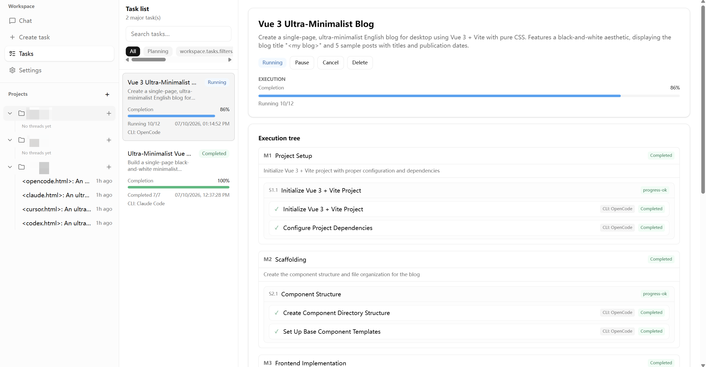

# codetask（AI 任务编排）

语言文档：

- [English](../README.md)
- 中文（本页）
- [日本語](README.ja.md)

**先把活规划好，人走开，回来再验收。**

codetask 是面向软件交付的桌面端 AI 任务编排应用。你在对话里冻结需求草案，强模型拆成 Coding Plan（Milestone → Slice → Task），实用 Agent CLI 在 OS 沙箱里 unattended 逐条执行；回来后在 Tasks 页看进度树、证据与失败点，重试、补洞、对话查漏补缺。



支持 **Codex**、**Claude Code**、**OpenCode**、**Cursor CLI** 作为规划与执行引擎；可跑 **Electron** 桌面，也可 **Server** 模式用浏览器访问。

## 要解决什么问题

传统「一个大 Prompt 让 Agent 干到底」在长需求上容易：

- 上下文腐烂，越写越偏
- 中途无法审阅，回来只能全盘重来
- 规划与执行混用同一模型，成本与质量难以平衡

codetask 的做法是：**人先定方向，强模型做规划，实用模型做执行，人回来验收补洞**。

典型使用场景：

1. **晚上出门前**：在对话里冻结需求草案，确认能力选型（Codex / Cursor CLI 等），启动 Planner 生成 Milestone → Slice → Task 计划
2. **离开电脑期间**：作业队列按依赖顺序，在 OS 沙箱里逐 Task 执行；Slice / Milestone 级自动校验
3. **回来后**：在 UI 里看进度树、证据与失败点，逐节点确认计划、重试阻塞任务、对话查漏补缺

## 核心理念

### 规划与执行分离（Control Plane）

| 阶段        | 角色                                    | 推荐策略                   | 说明                                   |
| ----------- | --------------------------------------- | -------------------------- | -------------------------------------- |
| 对话 / 草案 | `conversation`                          | 强模型 + 只读              | 澄清需求、冻结 REQUIREMENTS CONTRACT   |
| 计划生成    | `planner`                               | 强模型 + 只读              | 通过 MCP 注册结构化计划与任务上下文    |
| 任务落地    | `task-worker`                           | 实用 / 经济模型 + 沙箱可写 | 每个 Task 独立上下文，约 10 分钟可完成 |
| 阶段验收    | `slice-verifier` / `milestone-verifier` | 可按需配置                 | 只读校验 + 独立输出目录                |

控制面可在 **设置 → Control Plane** 中为 Planner / Verifier 单独指定 CLI（Codex、Claude Code、OpenCode、Cursor CLI）。草案里每个能力（ability）也可指定执行用的 `recommendedCoreCode`，实现「规划用好模型、执行用实用模型」。

### Coding Plan + SDK 执行层（更实惠）

对于长周期软件交付，用 **Coding Plan**（结构化的 Milestone → Slice → Task 作业）驱动 Agent，往往比自己在应用里逐轮调模型 API 更实惠、也更合理：每个 Task 上下文聚焦，可复用已有 CLI/SDK 订阅额度，也避免每次请求重复发送膨胀的上下文。

因此 codetask 选择 **对应 Agent SDK / CLI 作为执行层**（Codex SDK、Claude Agent SDK、OpenCode SDK、Cursor ACP），而非内嵌裸 HTTP API。各 Provider 接入统一运行时，用你已订阅的工具让计划队列 unattended 执行。

**小任务**用**普通对话**即可，不必生成 Coding Plan 或启动 Job。结构化的 Milestone → Slice → Task 流水线留给需要 unattended 执行、容易上下文腐烂的长需求。

### 小任务、防上下文腐烂（参考 GSD）

计划分解参考 GSD（Get Shit Done）的思路：

```
Milestone（里程碑）
  └── Slice（可演示的垂直增量）
        └── Task（单次 Agent 会话可完成的小任务，~10 分钟）
```

Planner 规则（见 `src/server/planner/prompts.ts`）：

- 宁可多拆小 Task，不要几个巨型 Task 混装无关改动
- 每个 Task 通过 MCP 注册**自包含**上下文（Read First / Files / Constraints / Do / Done When）
- 带明确 `successCriteria`、`abilityCode`、`taskKind` 与依赖关系
- UI 支持逐节点审阅、编辑、确认后再启动执行

### 沙箱隔离（参考 Codex）

Task Worker / Verifier 在 OS 级沙箱中运行，思路借鉴 [OpenAI Codex](https://github.com/openai/codex) 沙箱体系；native 层基于 `native/vendor/codex-rs` 与自研 `codeteam-*` crate 实现：

- **Planner / 对话**：不走外层 OS 沙箱，SDK/ACP 层只读
- **Task Worker**：工作区可写，宿主文件系统只读，独立 `runtimeRoot`
- **Fail closed**：沙箱 helper 或策略失败时立即终止，不回退到普通 `spawn()`

## 工作流

```
对话草案 → 确认 REQUIREMENTS CONTRACT → Planner 生成计划
    → 审阅 / 编辑 / 逐节点确认 → 启动 Job
        → Task Worker（沙箱）→ Slice 校验 → Milestone 校验
            → 完成 / 阻塞重试 → 回来对话查漏补缺
```

1. **草案阶段**：Wizard 引导冻结标题、验收、能力、参考资料
2. **规划阶段**：Planner Agent 调用 `register_task_context` + `register_plan` 写入 SQLite
3. **确认阶段**：`PlanReviewAccordion` 等 UI 逐 Milestone / Slice / Task 确认
4. **执行阶段**：单用户同时仅一个 running job；支持暂停、恢复、取消、重试与阻塞恢复
5. **验收阶段**：Verifier 按层级检查；失败任务可单独重跑

数据通过 **SSE** 推送作业快照；内嵌 **Hono** HTTP 服务供 Renderer 调用。

## 技术栈

| 层级   | 技术                                                                |
| ------ | ------------------------------------------------------------------- |
| 桌面壳 | Electron, electron-vite                                             |
| 前端   | Vue 3, Vue Router, Tailwind CSS, vue-i18n                           |
| 后端   | Hono, better-sqlite3, Drizzle ORM                                   |
| Agent  | @openai/codex-sdk, Claude Agent SDK, OpenCode SDK, Cursor ACP       |
| 沙箱   | Rust native（`native/codeteam-*`，Seatbelt / bwrap / Win32 helper） |

## 设计参考与致谢

- **GSD（Get Shit Done）** — 任务分解与计划结构：Milestone / Slice / Task 层级、明确完成标准、小步推进避免上下文腐烂
- **[OpenAI Codex](https://github.com/openai/codex)** — 沙箱隔离与 OS helper 思路；native 层 vendor 于 `native/vendor/codex-rs`
- **[t3code](https://github.com/pingdotgg/t3code)** — 桌面端体验参考：项目 / 对话 / 任务分层、多 Provider 接入、流式状态联动

## 运行模式

codetask 支持 **两种启动模式**，共用同一套内嵌 Hono 后端、SQLite 数据目录与沙箱 supervisor：

| 模式                    | 说明                                   | 默认监听         |
| ----------------------- | -------------------------------------- | ---------------- |
| **Desktop**（默认）     | Electron 打开原生窗口，加载本地 Web UI | `127.0.0.1:3000` |
| **Server**（`--serve`） | 无窗口 headless，用任意浏览器访问 URL  | `0.0.0.0:8080`   |

```bash
# 桌面模式（默认）
npm run dev

# 服务模式 / headless — 适合远程访问、WSL、无图形界面 Linux、纯浏览器工作流
npm run dev:serve

# 自定义 host/port（开发或打包后的应用）
electron . --serve --host 127.0.0.1 --port 9000
```

说明：

- **Server** 模式下 Electron 跳过 GPU 初始化，便于 WSL / CI / 无头环境运行。
- 绑定 `0.0.0.0` 时，局域网内其他设备可通过 `http://<你的IP>:<端口>` 访问 UI。
- 两种模式下 Job 执行、Planner、沙箱行为完全一致，仅外壳不同。

## 快速开始

### 环境要求

- Node.js 22+
- Rust toolchain（构建沙箱 native 组件时需要）
- 已安装并登录至少一种 Agent CLI：Codex、Claude Code、OpenCode 或 Cursor CLI
- Windows / macOS / Linux（沙箱能力与平台相关）

### 安装

```bash
npm install
```

### 开发模式

```bash
# 桌面模式（默认）— Electron 窗口
npm run dev

# 服务模式 — headless，浏览器访问（见上方「运行模式」）
npm run dev:serve
```

### 构建

```bash
# Windows（含沙箱）
npm run build:win

# macOS
npm run build:mac

# Linux
npm run build:linux
```

沙箱 native 需先编译：

```bash
npm run build:sandbox
```

### 测试

```bash
npm run test:unit
npm run test:provider-contract
npm run test:sandbox:tdd      # native sandbox TDD（需 build:sandbox）
npm run test:sandbox
npm run typecheck
npm run test:ci               # typecheck + 快速测试套件
```
